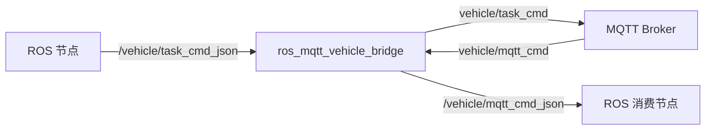

# ROS–MQTT Vehicle Bridge

[English](#english) · [中文](#中文)

一个面向 ROS 1 / Ubuntu 20.04 的轻量 JSON 消息桥接器，在 ROS Topic 与 MQTT Topic 之间双向转发任务和车辆消息。

> 本仓库是从实际车辆系统集成经验中整理出的通用公开版本。企业地址、账号、密码、私有消息定义、客户数据和构建产物均未包含。

## 中文

### 它解决什么问题

机器人或无人车通常在本机使用 ROS 通信，而调度平台、云端服务和 Web 系统更常使用 MQTT。本项目在两者之间提供一个边界清晰的桥接节点：



### 特性

- ROS → MQTT 与 MQTT → ROS 双向转发
- 使用 JSON 字符串，不依赖企业私有消息包
- Broker、Topic、客户端 ID 和 QoS 均可配置
- 用户名和密码只从环境变量读取，不写进代码或 YAML
- MQTT 自动重连，重连后恢复订阅
- 提供 Mosquitto 本地 Broker、任务示例和自动化质量检查

### 环境

- Ubuntu 20.04
- ROS Noetic
- CMake 3.0.2+
- Eclipse Paho MQTT C++

### 快速开始

安装依赖：

```bash
sudo apt update
sudo apt install ros-noetic-roscpp ros-noetic-std-msgs \
  libpaho-mqttpp-dev libpaho-mqtt-dev mosquitto-clients
```

把仓库放入 catkin 工作空间：

```bash
mkdir -p ~/catkin_ws/src
cd ~/catkin_ws/src
git clone https://github.com/QAQgpnu/ros-mqtt-vehicle-bridge.git
cd ..
catkin_make
source devel/setup.bash
```

启动本地 MQTT Broker：

```bash
docker compose up -d
```

启动桥接节点：

```bash
roslaunch ros_mqtt_vehicle_bridge bridge.launch
```

### 验证 ROS → MQTT

终端 1：

```bash
mosquitto_sub -h localhost -t vehicle/task_cmd -v
```

终端 2：

```bash
rostopic pub -1 /vehicle/task_cmd_json std_msgs/String \
  "data: '{\"task_id\":\"task-0001\",\"action\":\"move\",\"target\":{\"x\":1.2,\"y\":3.4}}'"
```

### 验证 MQTT → ROS

终端 1：

```bash
rostopic echo /vehicle/mqtt_cmd_json
```

终端 2：

```bash
mosquitto_pub -h localhost -t vehicle/mqtt_cmd \
  -m '{"command":"pause","reason":"operator_request"}'
```

### 使用带认证的 Broker

凭据只通过环境变量提供：

```bash
export MQTT_USERNAME='your-username'
export MQTT_PASSWORD='your-password'
roslaunch ros_mqtt_vehicle_bridge bridge.launch broker_uri:=tcp://broker.example.com:1883
```

不要把真实凭据写入 launch、YAML、README 或 Git 历史。

### 配置

默认配置位于 [`config/bridge.example.yaml`](config/bridge.example.yaml)。常用参数：

| 参数 | 默认值 | 说明 |
|---|---|---|
| `broker_uri` | `tcp://localhost:1883` | MQTT Broker 地址 |
| `mqtt_publish_topic` | `vehicle/task_cmd` | ROS → MQTT Topic |
| `mqtt_subscribe_topic` | `vehicle/mqtt_cmd` | MQTT → ROS Topic |
| `ros_subscribe_topic` | `/vehicle/task_cmd_json` | ROS 输入 Topic |
| `ros_publish_topic` | `/vehicle/mqtt_cmd_json` | ROS 输出 Topic |
| `qos` | `1` | MQTT QoS |

### 扩展到自定义车辆消息

公开版使用 `std_msgs/String`，因此开箱即用。若你的系统有自定义 `TaskCmd`：

1. 在独立 adapter 节点中把 `TaskCmd` 序列化为 JSON；
2. 发布到 `/vehicle/task_cmd_json`；
3. 从 `/vehicle/mqtt_cmd_json` 读取 JSON 并转换回内部消息。

这样可把企业消息定义与通用通信层隔离，方便测试和开源。

### 项目结构

```text
.
├── config/                 # 无凭据的参数示例
├── docs/                   # 架构和适配说明
├── examples/               # 可公开的 JSON 示例
├── launch/                 # ROS launch 文件
├── src/                    # C++ 桥接节点
├── tests/                  # 无 ROS 依赖的基础质量测试
├── CMakeLists.txt
└── package.xml
```

### 安全边界

- 不记录或提交 MQTT 密码
- 不默认使用公网 Broker
- 不在日志中输出认证信息
- 示例车辆 ID、坐标和任务均为虚构数据

## English

A small ROS 1 node that forwards JSON messages between ROS topics and MQTT topics. It is designed as a reproducible, vendor-neutral extraction of a vehicle integration workflow: no private message packages, customer endpoints, credentials, or proprietary data are included.

See the Chinese quick start above or [`docs/architecture.md`](docs/architecture.md) for the design.

## Contributing

Issues and pull requests are welcome. Please read [`CONTRIBUTING.md`](CONTRIBUTING.md) before submitting changes.

## License

MIT License. See [`LICENSE`](LICENSE).
